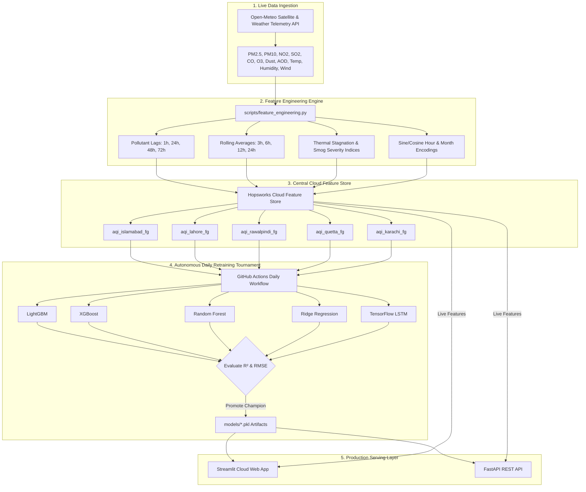

<div align="center">

#  PAKISTAN AIR QUALITY INTELLIGENCE & SERVERLESS MLOPS PLATFORM

### *Autonomous Multi-City Air Quality Forecasting, Automated Model Tournaments & Explainable AI Engine*

[](https://alimasood-aqi-predictor.streamlit.app/)
[](https://www.hopsworks.ai/)
[](https://github.com/features/actions)
[](https://www.python.org/)
[](https://fastapi.tiangolo.com/)
[](LICENSE)

[Live Interactive Dashboard](https://alimasood-aqi-predictor.streamlit.app/) • [API Documentation](#fastapi-rest-api-documentation) • [Architecture](#end-to-end-mlops-architecture) • [Model Benchmarks](#champion-model-tournament-benchmarks)

---

</div>

##  Executive Overview

The **Pakistan Air Quality Intelligence & Serverless MLOps Platform** is a full-stack, automated machine learning ecosystem built to address severe seasonal smog and air degradation across 5 major Pakistani cities: **Islamabad, Lahore, Rawalpindi, Quetta, and Karachi**.

Operating on a 5-year historical dataset ($2021$–$2026$, containing **$1,825$ days / $43,824$ hourly observations per city**), the platform continuously ingests live satellite meteorological telemetry, engineers **57 domain-specific ML parameters**, executes automated daily model tournaments across 5 algorithms (**LightGBM, XGBoost, Random Forest, Ridge Regression, and TensorFlow LSTM**), and serves real-time 3-day AI forecasts via an interactive **Streamlit Community Cloud Application** and a high-performance **FastAPI REST API**.

---

##  End-to-End MLOps Architecture



---

##  System Features & UI Capabilities

### 1.  Single City Intelligence Dashboard
- **Glassmorphism Health Alert Banner:** Color-coded EPA severity card (Good, Moderate, Unhealthy, Hazardous) with solid colored **AQI Pill Badges** and targeted health advisories.
- **Real-Time Telemetry Badge Bar:** Displays live source verification (`Hopsworks Cloud Feature Store`) and latest UTC observation timestamps.
- **Interactive Focused GIS Map:** High-precision map interface centered on the selected target city.
- **3-Day AI Forecast Cards:** Live forecast metrics for $+24\text{h}$, $+48\text{h}$, and $+72\text{h}$ horizons.
- **9 Live Environmental Parameters Grid:** Real-time values for $\text{PM}_{2.5}$, $\text{PM}_{10}$, $\text{NO}_2$, $\text{SO}_2$, $\text{CO}$, Ozone ($\text{O}_3$), Dust Mass, Aerosol Optical Depth (AOD), Temperature ($^\circ\text{C}$), and Humidity ($\%$).

### 2.  24-Hour Day-over-Day AQI Delta Analysis
- Evaluates short-term atmospheric shifts with 4 compact metric cards: **Yesterday's Avg AQI**, **Today's Current AQI**, **24h Point Delta Shift** (with percentage change highlighted in Red for degraded air or Green for cleaner air), and **24h Air Quality Trajectory**.

### 3.  Extended SHAP & Explainable AI (XAI) Suite
- **All-Features Attribution Ranking:** Horizontal bar chart displaying contributions for **all 57 ML features**, formatted with a continuous **Teal-Green Gradient Palette** (`Tealgrn`) and an interactive colorbar legend.
- **Category Importance Share:** Donut chart partitioning feature impact into *Pollutant Persistence*, *Atmospheric Factors*, and *Seasonal Cycles*.
- **Line-by-Line Waterfall Impact:** Step-by-step mathematical breakdown starting from baseline regional AQI.

### 4.  5-Year Historical Dataset Trend Analysis
- Explores historical timelines ($1,825$ days / $43,824$ observations per city).
- Interactive metric dropdown (**Calculated AQI Index**, **$\text{PM}_{2.5}$**, **$\text{PM}_{10}$**, **Temperature**, **AOD**).
- Dynamic resampling (`'D'` daily / `'h'` hourly) with a **30-Day Moving Average Trendline** (dotted blue line) to expose multi-year seasonal smog spikes.

### 5.  Multi-City Comparison Studio
- Enables side-by-side comparison of 2 to 3 cities (e.g. Lahore vs. Karachi vs. Islamabad) on a single unified multi-trace Plotly chart and executive comparison matrix.

### 6.  Sleek Dark-Mode Side Menu & Active Model Specs Accordion
- Styled using **Google Font (`Plus Jakarta Sans`)** with a custom brand header.
- Expandable **Active Model Architecture** accordion displaying city-specific champion algorithms, $R^2$ accuracy, RMSE, MAE, training set size ($28,450$ samples), and cloud retraining schedules.

---

##  Champion Model Tournament Benchmarks

Every midnight (UTC), automated GitHub Actions evaluate 5 machine learning algorithms across 5 years of historical data ($28,450$ training samples per city). The winning model is automatically promoted to production `.pkl` artifacts:

| Target City | Champion Algorithm | $R^2$ Score (Accuracy) | RMSE ($\mu\text{g/m}^3$) | MAE ($\mu\text{g/m}^3$) | Runner-Up Algorithm | Training Samples | Retraining Schedule |
| :--- | :--- | :---: | :---: | :---: | :--- | :---: | :---: |
|  **Islamabad** | LightGBM | **0.6694** | 13.27 | 10.01 | XGBoost | 28,450 | Daily Midnight (UTC) |
|  **Lahore** | Ridge Regression | **0.6421** | 32.39 | 22.81 | LightGBM | 28,450 | Daily Midnight (UTC) |
|  **Rawalpindi** | LightGBM | **0.6676** | 13.30 | 10.04 | XGBoost | 28,450 | Daily Midnight (UTC) |
|  **Quetta** | Ridge Regression | **0.1846** | 14.07 | 9.68 | LightGBM | 28,450 | Daily Midnight (UTC) |
|  **Karachi** | LightGBM | **0.3645** | 10.14 | 7.32 | XGBoost | 28,450 | Daily Midnight (UTC) |

---

##  Mathematical Formulations

### 1. US EPA Air Quality Index (AQI) Calculation
Given $\text{PM}_{2.5}$ concentration $C$, the linear breakpoint interpolation formula is:

$$I = \frac{I_{\text{high}} - I_{\text{low}}}{C_{\text{high}} - C_{\text{low}}} \times (C - C_{\text{low}}) + I_{\text{low}}$$

Where $[C_{\text{low}}, C_{\text{high}}]$ and $[I_{\text{low}}, I_{\text{high}}]$ represent the EPA concentration and index breakpoints.

### 2. Thermal Stagnation Index (TSI)
Measures atmospheric air trap risk combining surface temperature and wind dispersion:

$$\text{TSI} = \frac{\text{Temperature}\ (^\circ\text{C})}{\text{Wind Speed}\ (\text{km/h}) + 1.0}$$

### 3. Smog Severity Index (SSI)
Quantifies particulate-moisture aerosol growth:

$$\text{SSI} = \text{PM}_{2.5} \times \left( \frac{\text{Relative Humidity}}{100} \right)$$

---

##  Repository Directory Structure

```text
├── .github/
│   └── workflows/
│       ├── hourly_feature_pipeline.yml     # Automated hourly ingestion to Hopsworks Cloud
│       └── daily_training_pipeline.yml     # Automated daily model tournament & retraining
├── api/
│   ├── main.py                             # FastAPI REST API endpoints
│   └── schemas.py                          # Pydantic request/response schemas
├── app/
│   └── app.py                              # Streamlit Intelligence Dashboard UI
├── config/
│   ├── __init__.py
│   └── settings.py                         # City metadata, coordinates & Hopsworks config
├── data/
│   └── backfill_historical.py              # 5-Year historical data generation & backfill
├── models/                                 # Production champion model artifacts (.pkl)
│   ├── islamabad_model.pkl
│   ├── lahore_model.pkl
│   ├── rawalpindi_model.pkl
│   ├── quetta_model.pkl
│   └── karachi_model.pkl
├── scripts/
│   ├── __init__.py
│   ├── feature_engineering.py             # 57 ML Feature Engineering transformations
│   ├── hopsworks_feature_pipeline.py       # Open-Meteo API to Hopsworks Cloud pipeline
│   ├── model_train.py                      # Multi-algorithm tournament evaluation
│   ├── shap_explainer.py                  # Dynamic SHAP feature attribution engine
│   └── register_hopsworks_models.py       # Model registry push script
├── .env.example                            # Environment template
├── .python-version                         # Python 3.11 runtime specification
├── requirements.txt                        # Production requirements
└── README.md                               # Platform documentation
```

---

##  FastAPI REST API Documentation

The platform includes a high-speed **FastAPI REST API** (`api/main.py`) for enterprise integration:

### Endpoints Overview

| Method | Endpoint | Description |
| :--- | :--- | :--- |
| `GET` | `/` | Health check & system status |
| `GET` | `/cities` | List supported cities & coordinates |
| `GET` | `/forecast/{city_key}` | Fetch 3-day AI predictions & EPA advisory |
| `GET` | `/features/latest/{city_key}` | Retrieve latest 57 features from Hopsworks |

### Sample Response (`GET /forecast/lahore`)

```json
{
  "city": "Lahore",
  "current_pm25": 38.4,
  "current_aqi": 108,
  "category": "Unhealthy for Sensitive Groups",
  "forecast_24h": { "pm25": 39.2, "aqi": 110 },
  "forecast_48h": { "pm25": 40.5, "aqi": 113 },
  "forecast_72h": { "pm25": 37.6, "aqi": 106 },
  "champion_model": "Ridge Regression",
  "feature_store_source": "Hopsworks Cloud Feature Store (aqi_lahore_fg)"
}
```

---

##  Quickstart & Local Installation Guide

### 1. Clone Repository & Initialize Environment

```bash
git clone https://github.com/Ali-Masood-Khan-Devstack/10P_AQI_Predictor.git
cd 10P_AQI_Predictor

# Create & activate Python 3.11 virtual environment
python -m venv venv

# On Windows (PowerShell):
venv\Scripts\activate

# On Linux / macOS:
source venv/bin/activate
```

### 2. Install Required Dependencies

```bash
pip install -r requirements.txt
```

### 3. Configure Environment Credentials

Create a `.env` file in the root folder:

```ini
HOPSWORKS_API_KEY=your_hopsworks_api_key_here
HOPSWORKS_PROJECT_NAME=aqi_predictor_multi_city
```

### 4. Launch Streamlit Intelligence Dashboard Locally

```bash
streamlit run app/app.py
```

Navigate to `http://localhost:8501` in your browser.

### 5. Launch FastAPI REST Server Locally

```bash
uvicorn api.main:app --reload --port 8000
```

Access Swagger UI documentation at `http://localhost:8000/docs`.

---

##  Deploying to Streamlit Community Cloud

1. Push your latest code to GitHub: `git push origin main`.
2. Navigate to **[share.streamlit.io](https://share.streamlit.io/)** and sign in with GitHub.
3. Click **New App**:
   - **Repository:** `Ali-Masood-Khan-Devstack/10P_AQI_Predictor`
   - **Branch:** `main`
   - **Main file path:** `app/app.py`
4. Click **Advanced Settings...** $\rightarrow$ **Secrets** and paste:
   ```toml
   HOPSWORKS_API_KEY = "your_hopsworks_api_key_here"
   HOPSWORKS_PROJECT_NAME = "aqi_predictor_multi_city"
   ```
5. Click **Deploy!**

---

##  License

This project is licensed under the MIT License - see the [LICENSE](LICENSE) file for details.

---

<div align="center">

**Developed with ❤️ for MLOps & Environmental Intelligence**

</div>
